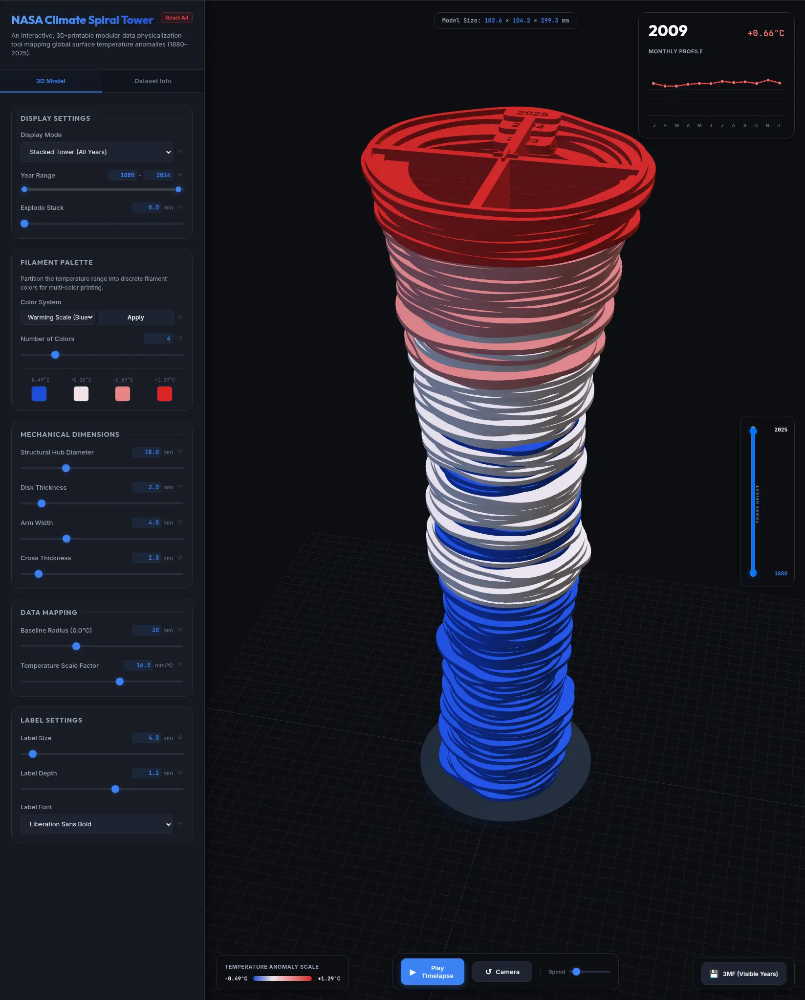

# NASA Climate Spiral Modular 3D Tower

An interactive data physicalization and 3D fabrication system. This tool converts the Goddard Institute for Space Studies (**NASA GISTEMP v4**) global temperature anomalies into
modular, physical 3D-printable annual "disks."

When stacked sequentially using an integrated cross plug-and-socket interface, these annual rings form a physical, tactile tower. The varying outer contours model global warming over
time ($1880 \to \text{present}$), making climate change directly tangible.



---

## 📁 Directory Structure

```
.
├── main.py                     # Python CLI controller (fetches, parses, and compiles STLs/SCAD)
├── web-configurator/           # Web configuration application subdirectory
│   ├── index.html              # Interactive 3D web visualizer (Three.js WebGL viewport)
│   ├── app.js                  # Visualizer logic: 3D spline math, SVG charting, binary STL exporter
│   └── styles.css              # Dark mode styling sheet
├── pyproject.toml              # Python project configuration
├── build/                      # Temporary and cache subdirectory
│   └── GLB.Ts+dSST.csv         # Cached raw GISTEMP CSV data downloaded from NASA
└── out/                        # Compiled assets and CAD output subdirectory
    ├── climate_data.json       # Parsed dataset in JSON format
    ├── climate_data.js         # Parsed dataset wrapped for browser direct loading (CORS-free)
    ├── climate_spiral_tower.scad # Parametric OpenSCAD script with embedded dataset
    └── [*.stl]                 # Generated 3D STL files
```

---

## 🚀 Quick Start

### 1. Set Up and Run the Python Engine

Download the latest climate anomalies and generate the default OpenSCAD and Web visualizer assets:

```bash
python3 main.py
```

*No external dependencies are required. The script uses Python's standard libraries.*

### 2. Launch the Web Visualizer

Open [index.html](web-configurator/index.html) directly in any web browser by double-clicking it.
Alternatively, spin up a local server:

```bash
python3 main.py --serve-web --web-port 8000
```

Then visit `http://localhost:8000/web-configurator/` in your browser.

### 3. Run in Docker

The Docker image includes the full Python 3.13 slim environment, the OpenSCAD CLI, and system fonts (Liberation Sans/Serif) for rendering authoritative 3D text labels.

#### Build the Image

```bash
docker build -t climate-spiral .
```

#### Run the Interactive Web Configurator

Spin up the local web server inside Docker:

```bash
docker run --rm -p 8000:8000 -v "$PWD/out:/app/out" -v "$PWD/build:/app/build" climate-spiral --serve-web --web-host 0.0.0.0 --web-port 8000
```

Then visit `http://localhost:8000/web-configurator/` in your browser.

* **On-the-Fly Generation & Caching:**
  When you modify settings in the UI, the Python backend dynamically invokes the OpenSCAD CLI inside the container to render and deboss labels on the authoritative year STLs. These are saved in a parameter-specific subfolder under `out/authoritative/`.
* **Volume Mounts for Caching:**
  * `-v "$PWD/out:/app/out"`: Persists custom exports and caches the dynamically compiled authoritative year STLs on the host filesystem so they don't have to be re-rendered when the container is restarted.
  * `-v "$PWD/build:/app/build"`: Persists the raw downloaded NASA CSV dataset, preventing re-downloading on container restarts.

---

## 🛠️ CLI Operations (main.py)

The CLI tool allows you to export ready-to-print binary STL meshes directly from the terminal.

```bash
# Export the 3D-printable STL file for a single year (e.g. 2024)
python3 main.py --year 2024 --stl

# Export separate STL files for all complete years in the dataset
python3 main.py --all-years --stl

# Stack all years into a single unified STL model with 1.0mm gaps
python3 main.py --all-years --stl --stack --spacing 1.0
```

### Key CAD Parameters:

* `--output-dir`: Output directory for STL files (defaults to `out/`).
* `--baseline-radius`: Radius in mm representing $0.0^\circ\text{C}$ anomaly (default: `25.0`).
* `--scale-factor`: Radial offset scale in mm per $1.0^\circ\text{C}$ temperature change (default: `10.0`).
* `--thickness`: Vertical thickness height of each disk in mm (default: `3.0`).
* `--hub-diameter`: Diameter of the central structural zone used by the interlocking cross (default: `18.0`).

### Authoritative OpenSCAD Text Labels (New)

Generate a single-year STL using OpenSCAD `text()` for the year label so preview/export geometry can converge on one backend source:

```bash
python3 main.py --authoritative-year 2024 --output-dir out
```

Optional flags:

* `--openscad-bin /path/to/openscad`
* `--openscad-docker-image climate-spiral-openscad` (runs OpenSCAD inside Docker)
* `--keep-authoritative-scad` (keeps temp SCAD source for inspection)

Generate a browser preview cache + manifest (best route for preview/export parity):

```bash
python3 main.py --authoritative-cache --authoritative-cache-years all --openscad-docker-image climate-spiral-openscad --output-dir out
```

This writes:

* `out/authoritative/manifest.json`
* `out/authoritative/<params-hash>/disk_<year>.stl`

The web configurator now attempts to load these authoritative STL meshes first, and falls back to procedural JS geometry if the manifest is missing or parameter-mismatched.

---

## 💻 Web Visualizer Features

* **Real-time CAD Adjustments**: Move the sliders on the left panel to dynamically rebuild the Three.js 3D meshes in the viewport.
* **Timelapse Animation**: Watch the tower construct itself year-by-year or scrub the active year.
* **Tactile Hover Details**: Hovering over any disk highlights it, displays its annual average anomaly, and maps its 12 calendar months on an interactive SVG chart.
* **Direct Browser Downloads**: Re-compile and download custom `.scad` or watertight binary `.stl` meshes directly from the Web interface.

---

## 🖨️ 3D Printing & Mechanical Recommendations

1. **Interlocking Orientation**:
   The system now uses a built-in cross plug (top) and cross socket (bottom) to align every year. The socket is intentionally a bit wider and deeper than the plug to account for
   print tolerances and bridge sag, so disks can still seat fully flush on well-tuned printers.
2. **Year Labels**:
   The generated OpenSCAD file (`out/climate_spiral_tower.scad`) automatically debosses the Year label (e.g., `"1924"`, `-0.5mm` deep) on the top surface of the hub (July side).
   This prints cleanly without support.
3. **Color Gradient Schemes**:
   To simulate the temperature gradient without multi-material setups:
    * **Filament Swap (Slicer-based)**: Set up your slicer to perform a filament color change at the mid-height layers of the disk (e.g., printing the base hub in white, and the
      outer data profile in red or blue).
    * **Spool swapping by Year**: Print earlier colder years (anomalies $< 0.0^\circ\text{C}$) in blue filaments, neutral years in white, and recent years in shades of orange and
      deep red.

# TODOs

## Python Backend (prio 1)

### Keep SCAD logic unified

Continue consolidating geometry behavior in [scad_core](climate_spiral/scad_core.py) so both [scad_export](climate_spiral/scad_export.py) and
[openscad_authoritative](climate_spiral/openscad_authoritative.py) stay in sync without drift.

## The 3D Model (prio 3)

### Save even more material

We are currently matching the inner edge of the outer ring to its outter edge, aka the width of the outter ring is always constant.
This is done to ensure there are no holes when viewing from the outside. However, this still wastes filament if the inner outter edge of the neighboring disks is further out than
the inner edge of the current disk. To improve this further, we could:

- limit the inner edge of the outter ring to be at the smaller of the inner edge of the outer ring of the neighboring disks (plus a small buffer probably). This would ensure that
  there are no holes when viewing from the outside, while also saving filament.
- however, this would also mean that looking into the structure from above would not represent the actual data anymore. I have not yet decided if this is a good tradeoff or not. It
  would be nice to have a toggle for this in the web configurator, so that the user can choose between the two options.

Alternatively, come up with a more clever way to align the disks in X and Y, that doesn't require four massive arms crossing through the center of everything. 

## Push git to remote

Select a remote location (GitHub probably) and push.
